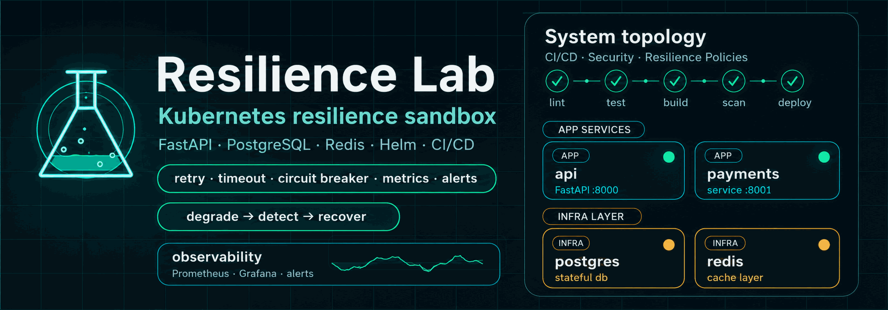

[](LICENSE)
[](https://github.com/lotoos0/resilience-lab/actions/workflows/ci.yml)
[](https://github.com/lotoos0/resilience-lab/actions/workflows/cd.yml)
[](https://codecov.io/gh/lotoos0/resilience-lab)
[](https://github.com/lotoos0/resilience-lab/security/code-scanning)



# Resilience Lab

**A Kubernetes sandbox for practicing cloud-native failure patterns before they hit production.**

This project gives you a realistic microservices environment — FastAPI, PostgreSQL, Redis — with observability, rate limiting, and resilience policies already configured. The idea is simple: break things here on purpose,
learn how they fail, and carry that knowledge to production. Not a toy demo. Not a tutorial app.
A working lab you can actually deploy and run experiments on.

---

## Why this project exists

Most demo apps only show the happy path. Resilience Lab is built for the opposite case.

It helps you practice what happens when services slow down, crash, overload Redis, hit rate limits,
or start returning 5xx errors — with real Kubernetes, Envoy policies, metrics, logs, dashboards,
alerts, and runbooks in place.

Use it to practice DevOps/SRE workflows, test failure scenarios, and show a working Kubernetes-based project in your portfolio.

---

## What's in the box

- **API + Payments services** — FastAPI, Python 3.11, Prometheus metrics, per-tenant rate limiting backed by Redis
- **Networking layer** — Traefik ingress → Envoy front-proxy (retry, per-try timeout, circuit breaker, outlier ejection, bulkhead)
- **Observability** — Prometheus + Grafana (System Overview + Traffic & Latency dashboards), Loki + Promtail logs, alert rules
- **Kubernetes-ready** — Helm charts, HPA, PDB, NetworkPolicy, non-root security baseline
- **CI/CD** — GitHub Actions: lint → test → integration → build → publish to GHCR
- **Chaos engineering** — fault injection scripts (failure, latency, pod kill) + operational runbooks

---

## Quick Start

| Goal | Command |
|------|---------|
| Run the app locally | `make dev` |
| Run resilience experiments in Kubernetes | `make helm-up-dev` |

### Local (Docker Compose)

```bash
git clone https://github.com/lotoos0/resilience-lab.git
cd resilience-lab
make dev
```

Services will be up at:
- API: http://localhost:8000
- Payments: http://localhost:8001

```bash
curl http://localhost:8000/healthz   # {"status":"healthy","service":"api"}
curl http://localhost:8001/healthz   # {"status":"healthy","service":"payments"}
make down                            # stop everything
```

**Prerequisites:** Docker 24+, Docker Compose v2+, Python 3.11+, Make.

---

## Kubernetes (Helm)

```bash
# Create a local cluster — k3d is the recommended option
k3d cluster create resilience-cluster --api-port 6550 --servers 1 --agents 2 --port "8080:80@loadbalancer"

# Deploy
make helm-deps
make helm-up-dev

# Verify
kubectl get pods -n resilience-lab

# Tear down
make helm-down
```

For minikube/kind, custom values, and troubleshooting: [docs/DEPLOYMENT.md](docs/DEPLOYMENT.md)

---

## Architecture

```
        User / Browser
               │
               ▼
       ┌──────────────┐
       │   Traefik    │  ← HTTPS ingress (TLS termination)
       └──────┬───────┘
              │
              ▼
       ┌──────────────┐
       │    Envoy     │  ← front-proxy: retry, timeout, circuit breaker
       └──────┬───────┘
              │
         ┌────┴────┐
         ▼         ▼
  ┌───────────┐ ┌───────────┐
  │    API    │ │  Payments │
  │ :8000     │ │ :8001     │
  └─────┬─────┘ └────┬──────┘
        └──────┬──────┘
               │
        ┌──────┴───────┐
        ▼              ▼
  ┌───────────┐  ┌───────────┐
  │PostgreSQL │  │  Redis    │
  └───────────┘  └───────────┘
```

Envoy sits between the ingress and your services and handles the resilience layer: failed requests are
retried automatically, slow responses get cut off before they cascade, and hosts that start returning
errors get temporarily ejected from the pool. Rate limiting lives in the API service — per tenant,
backed by Redis, so it works correctly across replicas.

---

## Current state — preparing v0.1.0

M0–M3 complete. The full stack is working and validated.

**Resilience primitives:**
- ✅ Rate limiting — Redis-backed, per-tenant, k6 validated
- ✅ Envoy retry with per-try timeout (200ms) and exponential backoff
- ✅ Outlier ejection, circuit breaker, bulkhead — tuned and stress-tested
- ✅ HPA + PDB — auto-scaling and disruption budget validated under load

**Observability:**
- ✅ Prometheus metrics + ServiceMonitors + recording rules
- ✅ Alert rules (HighErrorRate, APIDown, PrometheusTargetDown)
- ✅ Grafana: System Overview + Traffic & Latency dashboards (retries, ejections, 429s, bulkhead overflow)
- ✅ Loki + Promtail log aggregation, LogQL in Grafana Explore

**Chaos engineering:**
- ✅ Latency injection — 300ms tc netem delay on Payments, Grafana evidence captured
- ✅ Pod kill — auto-recovery ~15s, HPA/PDB behavior documented
- ✅ Runbooks: chaos-pod-kill, chaos-latency-injection, rollback-vs-recover

Next: release notes, CHANGELOG, merge to main, tag **v0.1.0**.

---

## Testing resilience

Requires the Helm deployment to be running (`make helm-up-dev`).

```bash
# Inject 300ms latency to Payments (triggers Envoy retries and timeout behavior)
./scripts/fault-inject.sh latency

# Kill a Payments pod (tests auto-recovery, HPA, PDB behavior)
./scripts/fault-inject.sh kill

# Inject failures — Payments returns 500 (triggers outlier ejection)
./scripts/fault-inject.sh failure

# Cleanup all injections
./scripts/fault-inject.sh cleanup
```

Watch Envoy stats during a test:

```bash
kubectl port-forward -n resilience-lab svc/envoy-proxy 9901:9901
curl http://localhost:9901/stats | grep -E 'outlier|retry|timeout'
```

For step-by-step procedures, expected Grafana graphs, and evidence screenshots:
[docs/runbooks/](docs/runbooks/README.md)

---

## Development

```bash
make install      # install dev dependencies
make test         # run all tests (requires: make dev)
make test-unit    # unit tests only (no services needed)
make lint         # ruff
make help         # full list of targets
```

Coding standards, project structure, and onboarding: [docs/DEVELOPMENT.md](docs/DEVELOPMENT.md)

---

## Docs

| Doc | What's in it |
|-----|-------------|
| [Architecture](docs/ARCHITECTURE.md) | System design, ADRs, design patterns |
| [Development](docs/DEVELOPMENT.md) | Setup, structure, coding standards |
| [Deployment](docs/DEPLOYMENT.md) | Full Helm deployment guide |
| [Observability](docs/observability.md) | Prometheus, Grafana, Loki, LogQL, chaos PromQL queries |
| [Security](docs/security.md) | Security baseline, CVE patching, Trivy |
| [M3 Resilience Patterns](docs/M3_RESILIENCE_PATTERNS.md) | Rate limiting, bulkhead, load tests |
| [Runbooks](docs/runbooks/README.md) | Operational runbooks: chaos, observability, troubleshooting |
| [Retrospectives](docs/RETROSPECTIVES.md) | Milestone retrospectives |
| [Contributing](CONTRIBUTING.md) | PR process, commit format |

---

## License

MIT — see [LICENSE](LICENSE).
