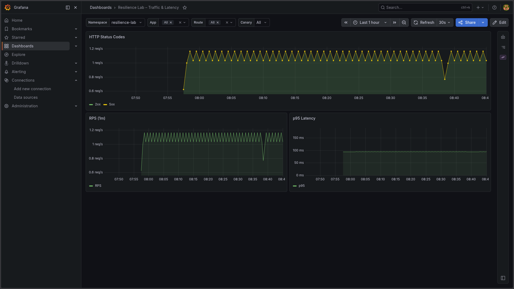
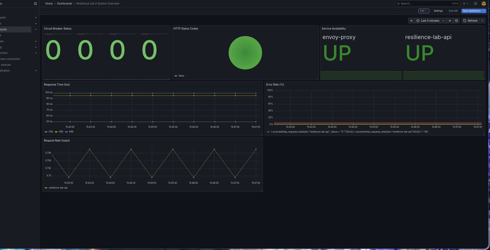

# Observability

This document describes the current v0.1.0 observability baseline for Resilience Lab.

## Current Scope

Implemented:

- API metrics endpoint: `GET /metrics`
- API health endpoint: `GET /healthz`
- Envoy Prometheus stats endpoint: `GET /stats/prometheus` on the admin port
- Prometheus `ServiceMonitor` for API metrics
- Prometheus `ServiceMonitor` for Envoy metrics
- Prometheus recording rules for API, Envoy, and basic availability metrics
- Basic Prometheus alert rules for v0.1.0
- Grafana system overview dashboard JSON
- Loki + Promtail log aggregation with a Loki datasource in Grafana (issue `#38`)
- Chaos observability queries: pod kill recovery and latency injection monitoring (issue `#42`)

Planned in separate issues:

- OpenTelemetry tracing baseline: GitHub issue `#60`
- Resilience dashboard panels: GitHub issues `#36`, `#37`, `#50`

Known limitations:

- Payments does not expose `/metrics` yet.
- Advanced multi-window burn-rate SLO alerting is deferred to the post-v0.1.0 backlog.
- `docs/outputs/*` files are evidence snapshots, not live monitoring state.

## Metrics Endpoints

### API

The API service exposes FastAPI/HTTP metrics through `prometheus-fastapi-instrumentator`.

```text
GET /metrics
```

Key metrics:

- `http_requests_total`
- `http_request_duration_seconds`
- `rl_allowed_total`
- `rl_denied_total`

The rate-limit metrics are emitted by `services/api/middleware/rate_limit.py` and are labelled by tenant.

### Envoy

Envoy exposes Prometheus-formatted metrics on the admin listener.

```text
GET /stats/prometheus
```

Key metric areas:

- upstream requests
- upstream 5xx responses
- retry counters
- outlier detection counters
- circuit breaker counters

## Logging (Loki + Promtail)

Logs from API, Payments, and Envoy are aggregated in Loki and browsable through
the Grafana **Explore** view.

Deployment:

- Helm release `loki` (chart `grafana/loki-stack`) in the `monitoring` namespace, bundling
  Loki and Promtail in a single release.
- Values: `deploy/loki/values.yaml` (small persistent volume sized for a single-node
  minikube lab, ~7 day retention to match Prometheus).
- The chart auto-provisions a Grafana datasource named **Loki** (pointing at
  `http://loki:3100`) via the same sidecar mechanism used for the Prometheus/Alertmanager
  datasources — no extra manifest needed.

Install/upgrade:

```bash
helm repo add grafana https://grafana.github.io/helm-charts
helm upgrade --install loki grafana/loki-stack -n monitoring -f deploy/loki/values.yaml
```

Check status:

```bash
helm status loki -n monitoring
kubectl get pods -n monitoring -l release=loki
kubectl get pods -n monitoring -l app.kubernetes.io/name=promtail
```

### Labels

Promtail's default Kubernetes pipeline derives labels from pod metadata, so logs are
queryable per service via the `app` label (taken from `app.kubernetes.io/name`, falling
back to the `app` pod label):

- `{app="api"}` — Resilience Lab API
- `{app="payments"}` — Payments service
- `{app="envoy-proxy"}` — Envoy proxy

Other useful labels: `namespace`, `pod`, `container`, `node_name`, `job`
(`<namespace>/<app>`).

### Example LogQL queries

Service-level filtering:

```logql
{app="api"}
{app="payments"}
{app="envoy-proxy"}
```

Line filtering (substring match):

```logql
{app="api"} |= "healthz"
{app="api"} |= "error"
```

Parsing JSON container log lines and reformatting to show just the application message:

```logql
{namespace="resilience-lab"} | json | line_format "{{.log}}"
```

Tenant/request context: the rate-limit middleware
(`services/api/middleware/rate_limit.py`) logs a `logfmt`-style line per request —
`rate_limit_check tenant=<tenant> path=<path> status=<allowed|denied> count=<n> limit=<n>` —
so it can be parsed and filtered by tenant:

```logql
{app="api"} |= "rate_limit_check" | json | line_format "{{.log}}" | logfmt | tenant="acme"
{app="api"} | json | line_format "{{.log}}" | logfmt | status="denied"
```

> Note: container log lines arrive at Loki wrapped in the container runtime's JSON
> envelope (`{"log": "...", "stream": "...", "time": "..."}`), so `| logfmt` alone
> won't see the `tenant=`/`status=` fields — unwrap with `| json | line_format
> "{{.log}}"` first, as in the "Parsing JSON container log lines" example above.

### Verification

Open Grafana → **Explore**, select the **Loki** datasource, and run the queries above.
Use the label browser to confirm `app`, `namespace`, and `container` values match the
expected services.

## Grafana Dashboards

The "Resilience Lab 0 System Overview" dashboard (`uid: adnxcgd`) is provisioned
as code, the same way `kube-prometheus-stack` loads its bundled dashboards and
`loki` provisions its datasource:

- Dashboard JSON lives in the chart at `deploy/helm/dashboards/system-overview.json`.
- `deploy/helm/templates/grafana-dashboard-system-overview.yaml` wraps it in a
  `ConfigMap` labeled `grafana_dashboard: "1"`.
- The `grafana-sc-dashboard` sidecar (`k8s-sidecar`, watching all namespaces)
  picks up the labeled ConfigMap and loads the dashboard into Grafana automatically
  — no manual import needed.

Verification:

```bash
kubectl get configmap -n resilience-lab -l grafana_dashboard=1
curl -u admin:<password from Secret prometheus-grafana> http://localhost:3000/api/search
```

`/api/search` should list "Resilience Lab 0 System Overview" at
`/d/adnxcgd/resilience-lab-0-system-overview`.

### Resilience Lab – Traffic & Latency

The "Resilience Lab – Traffic & Latency" dashboard (`uid: resilience-core`) is
provisioned the same way, via `deploy/helm/dashboards/resilience.json` and
`deploy/helm/templates/grafana-dashboard-resilience.yaml`. Panels:

- HTTP Status Codes, RPS (1m), p95 Latency
- Envoy Retries — rate 5m (`envoy:retries:rate5m`, by `envoy_cluster_name`)
- Outlier Ejections — rate 5m (`envoy:outlier_ejections:rate5m`, by `envoy_cluster_name`)
- Rate Limit Denials / 429 — rate 5m (`api:rate_limit_denied:rate5m`, by `tenant`)
- Envoy Bulkhead Overflow — rate 5m (`envoy:bulkhead_overflow:rate5m`, by `envoy_cluster_name`)

The retry/ejection/429/bulkhead panels read from the recording rules above
rather than the raw `*_total` counters, so they show smoothed per-second
rates instead of ever-growing totals.





## Prometheus Configuration

Prometheus-related manifests:

- `deploy/prometheus/values.yaml`
- `deploy/prometheus/servicemonitor-api.yaml`
- `deploy/prometheus/servicemonitor-envoy.yaml`
- `deploy/prometheus/rules.yaml`

The main `PrometheusRule` is `resilience-lab-rules` in the `monitoring` namespace.

```bash
kubectl get prometheusrule -n monitoring
kubectl describe prometheusrule resilience-lab-rules -n monitoring
```

## Recording Rules

The project currently defines recording rules for:

- Envoy request rate
- Envoy 5xx error rate
- Envoy p95 upstream request duration
- Envoy active upstream connections
- Envoy retry rate (`envoy:retries:rate5m`)
- Envoy outlier ejection rate (`envoy:outlier_ejections:rate5m`)
- Envoy bulkhead overflow rate (`envoy:bulkhead_overflow:rate5m`)
- API request rate
- API 5xx error rate
- Rate-limit allowed/denied request rates
- Basic target availability ratio

These rules live in `deploy/prometheus/rules.yaml`.

## Alert Rules

The v0.1.0 alert baseline is intentionally small and practical.

### HighErrorRate

Fires when more than 5% of API requests return 5xx responses for 5 minutes while the API is receiving traffic.

Purpose:

- catch application regressions;
- catch upstream dependency failures surfaced through the API;
- provide a simple demo-friendly error-rate alert.

### APIDown

Fires when Prometheus cannot scrape the API target for 1 minute, or when the API target is not discovered at all.

Purpose:

- catch API pod/service/scrape failures;
- validate that API monitoring is not silently broken.

### PrometheusTargetDown

Fires when any target in the `resilience-lab` namespace is down for more than 2 minutes, or when no target from the `resilience-lab` namespace is discovered at all.

Purpose:

- catch scrape degradation across the lab;
- detect failures in API, Envoy, or future monitored targets.

## Verification

Apply the rules:

```bash
kubectl apply -f deploy/prometheus/rules.yaml
```

Check the rule object:

```bash
kubectl get prometheusrule -n monitoring
kubectl describe prometheusrule resilience-lab-rules -n monitoring
```

Port-forward Prometheus:

```bash
kubectl port-forward -n monitoring svc/prometheus-kube-prometheus-prometheus 9090:9090
```

Open:

```text
http://localhost:9090/targets
http://localhost:9090/alerts
```

Expected healthy state:

- API target is `UP`;
- Envoy target is `UP`;
- alert rules are visible;
- alerts are not `FIRING` in a healthy environment.

If Prometheus shows only `kube-system` and `monitoring` targets, and no `resilience-lab` targets, check ServiceMonitor discovery:

```bash
kubectl get namespace --show-labels
kubectl get servicemonitor -A
kubectl get svc -n resilience-lab --show-labels
kubectl get endpoints -n resilience-lab
kubectl describe servicemonitor -n monitoring resilience-lab-api-metrics
kubectl describe servicemonitor -n monitoring envoy-proxy-metrics
```

The expected setup is:

- `resilience-lab-api-metrics` exists in the `monitoring` namespace;
- `envoy-proxy-metrics` exists in the `monitoring` namespace;
- the API Service labels match `app.kubernetes.io/name: api`;
- the Envoy Service labels match `app: envoy-proxy`;
- the `resilience-lab` namespace exists and contains the API and Envoy services.

## Optional APIDown Test

Scale API down:

```bash
kubectl scale deployment -n resilience-lab resilience-lab-api --replicas=0
```

Wait 1-3 minutes, then check:

```text
http://localhost:9090/alerts
```

Restore API:

```bash
kubectl scale deployment -n resilience-lab resilience-lab-api --replicas=2
```

## Chaos Observability

PromQL queries for observing the system during chaos experiments. Use these in
Prometheus UI (`http://localhost:9090`) or in Grafana → **Explore** with the
Prometheus datasource selected.

Full runbooks: [`docs/runbooks/chaos-pod-kill.md`](runbooks/chaos-pod-kill.md),
[`docs/runbooks/chaos-latency-injection.md`](runbooks/chaos-latency-injection.md),
[`docs/runbooks/rollback-vs-recover.md`](runbooks/rollback-vs-recover.md).

### Pod Kill — Recovery Monitoring

```promql
# Available replicas — drops to 0 on kill, recovers in ~15s
kube_deployment_status_replicas_available{deployment="resilience-lab-payments"}

# Pod restart counter — increments after each kill
kube_pod_container_status_restarts_total{namespace="resilience-lab", container="payments"}

# Envoy outlier ejections — should stay 0 during fast pod recovery
envoy:outlier_ejections:rate5m
```

Verify no alerts fired during the test:

```promql
ALERTS{alertname=~"HighErrorRate|APIDown|PrometheusTargetDown", alertstate="firing"}
```

Expected result: `no data` (empty vector).

### Latency Injection — Monitoring 300ms netem Delay

```promql
# Envoy p95 upstream latency — rises to ~300ms+ during injection
envoy:upstream_rq_time_p95:rate5m

# API 5xx error rate — should remain low (Envoy retries absorb slow responses)
api:http_5xx:rate5m

# Envoy retry rate — rises when upstream latency triggers timeout retries
envoy:retries:rate5m
```

LogQL to correlate payments logs during injection:

```logql
{app="payments"} | json | line_format "{{.log}}"
```

### Grafana Panels to Watch

Open the **"Resilience Lab – Traffic & Latency"** dashboard during any chaos
experiment and monitor:

| Panel | Expected behaviour during chaos |
|-------|--------------------------------|
| p95 Latency | Spikes to 300ms+ during latency injection; normal during pod kill |
| Envoy Retries | Rises during latency injection if timeout triggers retries |
| Outlier Ejections | Should remain 0 (payments recovers before ejection threshold) |
| HTTP Status Codes | No spike in 5xx during pod kill (Envoy routes around dead pod) |

## Troubleshooting

If the API target is down, start with:

- `docs/runbooks/TROUBLESHOOTING_OBSERVABILITY_TARGETS.md`
- `docs/runbooks/TROUBLESHOOTING_PROMETHEUS_SCRAPE.md`
- `kubectl get pods -n resilience-lab`
- `kubectl logs -n resilience-lab deployment/resilience-lab-api`
- `kubectl get servicemonitor -n monitoring`
- `kubectl get netpol -n resilience-lab`

Common causes:

- NetworkPolicy blocks Prometheus from scraping API or Envoy;
- ServiceMonitor selector does not match service labels;
- Prometheus release label does not match the kube-prometheus-stack selector.
