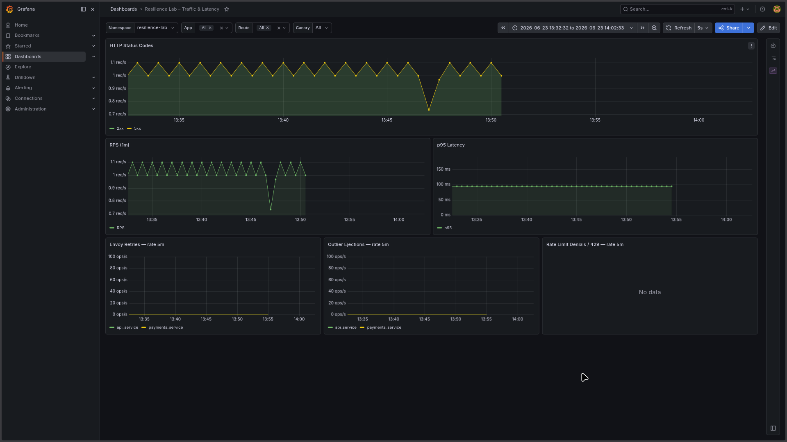
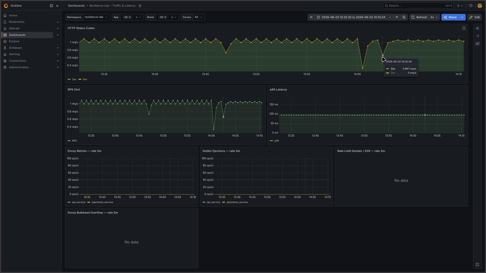

# Observability

*Last updated: 2026-06-25*

If something is broken and you don't know why, this is the right document. It covers
what Prometheus scrapes, where dashboards live, which alerts exist, and how to watch
the system fall over and recover during chaos experiments.

---

## Table of Contents

- [Current Scope](#current-scope)
- [Metrics Endpoints](#metrics-endpoints)
- [Logging (Loki + Promtail)](#logging-loki--promtail)
- [Grafana Dashboards](#grafana-dashboards)
- [Prometheus Configuration](#prometheus-configuration)
- [Recording Rules](#recording-rules)
- [Alert Rules](#alert-rules)
- [Quick Verification](#quick-verification)
- [Chaos Observability](#chaos-observability)
- [Troubleshooting](#troubleshooting)
- [What changed in this document](#what-changed-in-this-document)

---

## Current Scope

What's wired up and working in v0.1.0:

- API `/metrics` endpoint (prometheus-fastapi-instrumentator)
- Payments `/metrics` endpoint (same instrumentator, same setup)
- Envoy `/stats/prometheus` on the admin port
- Prometheus `ServiceMonitor` for API, Payments, and Envoy
- 14 recording rules — Envoy, API, rate-limit, and pod availability metrics
- 3 alert rules: `HighErrorRate`, `APIDown`, `PrometheusTargetDown`
- 2 Grafana dashboards: System Overview and Traffic & Latency
- Loki + Promtail log aggregation, auto-provisioned Grafana datasource

Planned but not yet done:

- OpenTelemetry tracing baseline: issue `#60`
- Resilience dashboard panels: issue `#50`
- Advanced multi-window burn-rate SLO alerting: post-v0.1.0 backlog

---

## Metrics Endpoints

### API

The API service exposes FastAPI/HTTP metrics through `prometheus-fastapi-instrumentator`.

```text
GET /metrics
```

Key metrics:

- `http_requests_total`
- `http_request_duration_seconds`
- `rl_allowed_total`
- `rl_denied_total`

The rate-limit counters are emitted by `services/api/middleware/rate_limit.py` and
labelled by tenant.

### Payments

Same instrumentator setup as API:

```text
GET /metrics
```

Exposes standard FastAPI HTTP metrics. No rate-limit counters — those live in the
API middleware only.

### Envoy

Envoy exposes Prometheus-formatted metrics on the admin listener:

```text
GET /stats/prometheus
```

Key metric areas: upstream requests, upstream 5xx responses, retry counters, outlier
detection counters, circuit breaker counters.

---

## Logging (Loki + Promtail)

Logs from API, Payments, and Envoy are aggregated in Loki and browsable through
Grafana **Explore**.

**Deployment:**

- Helm release `loki` (chart `grafana/loki-stack`) in the `monitoring` namespace —
  bundles Loki and Promtail in a single release.
- Values: `deploy/loki/values.yaml` (~7 day retention, sized for a single-node
  minikube lab).
- Auto-provisions a Grafana datasource named **Loki** (`http://loki:3100`) via the
  same sidecar mechanism as Prometheus/Alertmanager — no extra manifest needed.

**Install/upgrade:**

```bash
helm repo add grafana https://grafana.github.io/helm-charts
helm upgrade --install loki grafana/loki-stack -n monitoring -f deploy/loki/values.yaml
```

**Check status:**

```bash
helm status loki -n monitoring
kubectl get pods -n monitoring -l release=loki
kubectl get pods -n monitoring -l app.kubernetes.io/name=promtail
```

### Labels

Promtail derives labels from pod metadata. Services are queryable via the `app` label:

- `{app="api"}` — Resilience Lab API
- `{app="payments"}` — Payments service
- `{app="envoy-proxy"}` — Envoy proxy

Other useful labels: `namespace`, `pod`, `container`, `node_name`, `job`
(`<namespace>/<app>`).

### Example LogQL queries

Service-level filtering:

```logql
{app="api"}
{app="payments"}
{app="envoy-proxy"}
```

Line filtering:

```logql
{app="api"} |= "healthz"
{app="api"} |= "error"
```

Parsing JSON container log lines:

```logql
{namespace="resilience-lab"} | json | line_format "{{.log}}"
```

Tenant/rate-limit context — the rate-limit middleware logs a `logfmt`-style line per
request: `rate_limit_check tenant=<t> path=<p> status=<allowed|denied> count=<n> limit=<n>`:

```logql
{app="api"} |= "rate_limit_check" | json | line_format "{{.log}}" | logfmt | tenant="acme"
{app="api"} | json | line_format "{{.log}}" | logfmt | status="denied"
```

> Container log lines arrive wrapped in the runtime's JSON envelope
> (`{"log": "...", "stream": "...", "time": "..."}`), so `| logfmt` alone won't see
> the `tenant=`/`status=` fields — unwrap with `| json | line_format "{{.log}}"` first.

### Verification

Open Grafana → **Explore**, select the **Loki** datasource, and run `{app="api"}`.
Use the label browser to confirm `app`, `namespace`, and `container` values match.

---

## Grafana Dashboards

Both dashboards are provisioned as code via labeled ConfigMaps picked up by the
`grafana-sc-dashboard` sidecar — no manual import needed.

### Resilience Lab 0 System Overview (`uid: adnxcgd`)

- JSON: `deploy/helm/dashboards/system-overview.json`
- Template: `deploy/helm/templates/grafana-dashboard-system-overview.yaml`
- URL: `/d/adnxcgd/resilience-lab-0-system-overview`


### Resilience Lab – Traffic & Latency (`uid: resilience-core`)

- JSON: `deploy/helm/dashboards/resilience.json`
- Template: `deploy/helm/templates/grafana-dashboard-resilience.yaml`
- URL: `/d/resilience-core/...`

Panels: HTTP Status Codes, RPS (1m), p95 Latency, Envoy Retries rate 5m, Outlier
Ejections rate 5m, Rate Limit Denials/429 rate 5m (by tenant), Envoy Bulkhead
Overflow rate 5m. All rate/ejection panels read from recording rules, not raw counters.


**Verification:**

```bash
kubectl get configmap -n resilience-lab -l grafana_dashboard=1
curl -u admin:<password from Secret prometheus-grafana> http://localhost:3000/api/search
```

`/api/search` should return both `adnxcgd` and `resilience-core`.

---

## Prometheus Configuration

Manifests:

- `deploy/prometheus/values.yaml`
- `deploy/prometheus/servicemonitor-api.yaml`
- `deploy/prometheus/servicemonitor-payments.yaml`
- `deploy/prometheus/servicemonitor-envoy.yaml`
- `deploy/prometheus/rules.yaml`

The main `PrometheusRule` is `resilience-lab-rules` in the `monitoring` namespace:

```bash
kubectl get prometheusrule -n monitoring
kubectl describe prometheusrule resilience-lab-rules -n monitoring
```

---

## Recording Rules

14 rules defined in `deploy/prometheus/rules.yaml`:

**Envoy (7 rules):**

- `envoy:http_requests:rate5m` — request rate
- `envoy:http_errors_5xx:rate5m` — 5xx error rate
- `envoy:http_request_duration:p95` — p95 upstream latency
- `envoy:upstream_connections:current` — active upstream connections
- `envoy:retries:rate5m` — retry rate
- `envoy:outlier_ejections:rate5m` — outlier ejection rate
- `envoy:bulkhead_overflow:rate5m` — bulkhead overflow rate

**API (4 rules):**

- `api:http_requests:rate5m` — request rate
- `api:http_errors:rate5m` — error rate
- `api:rate_limit_denied:rate5m` — rate-limit denials by tenant
- `api:rate_limit_allowed:rate5m` — rate-limit passes by tenant

**Availability (3 rules):**

- `resilience_lab:pod_available:count` — available pod count
- `resilience_lab:pod_total:count` — total pod count
- `resilience_lab:availability:ratio` — availability ratio (available/total)

---

## Alert Rules

The v0.1.0 alert baseline is intentionally small — three rules that cover the cases
most likely to page someone at 3am.

### HighErrorRate

Fires when more than 5% of API requests return 5xx for 5 consecutive minutes while
the API is receiving traffic. Catches application regressions and upstream dependency
failures before they become visible outages.

### APIDown

Fires when Prometheus cannot scrape the API target for 1 minute, or when the target
is not discovered at all. If this fires in a healthy cluster, check ServiceMonitor
selectors and NetworkPolicy first.

### PrometheusTargetDown

Fires when any target in the `resilience-lab` namespace is unreachable for more than
2 minutes, or when no target is discovered at all. Broader than `APIDown` — covers
Envoy, Payments, and any future monitored service in the namespace.

---

## Quick Verification

Run this after deploying or upgrading the stack.

### Prometheus

```bash
kubectl port-forward -n monitoring svc/prometheus-kube-prometheus-prometheus 9090:9090
```

Open `http://localhost:9090/targets` — API, Payments, and Envoy targets should be `UP`.
Open `http://localhost:9090/alerts` — rules visible, none `FIRING` in a healthy cluster.

If `resilience-lab` targets are missing:

```bash
kubectl get servicemonitor -A
kubectl get svc -n resilience-lab --show-labels
kubectl describe servicemonitor -n monitoring resilience-lab-api-metrics
```

Apply or re-apply rules if needed:

```bash
kubectl apply -f deploy/prometheus/rules.yaml
kubectl get prometheusrule -n monitoring
```

### Loki

Open Grafana → **Explore** → Loki datasource, run `{app="api"}`. If no logs appear,
check Promtail pods in `monitoring` and verify the `resilience-lab` namespace labels.

### Grafana dashboards

```bash
curl -u admin:<password from Secret prometheus-grafana> http://localhost:3000/api/search
```

Should return both `resilience-lab-0-system-overview` and `resilience-core`.

### Optional: trigger APIDown alert

```bash
kubectl scale deployment -n resilience-lab resilience-lab-api --replicas=0
# wait 1-3 min, check http://localhost:9090/alerts
kubectl scale deployment -n resilience-lab resilience-lab-api --replicas=2
```

---

## Chaos Observability

PromQL queries for watching the system during chaos experiments. Use these in
Prometheus UI (`http://localhost:9090`) or Grafana → **Explore** with the Prometheus
datasource.

Full runbooks: [`chaos-pod-kill.md`](runbooks/chaos-pod-kill.md),
[`chaos-latency-injection.md`](runbooks/chaos-latency-injection.md),
[`rollback-vs-recover.md`](runbooks/rollback-vs-recover.md).

### Pod Kill — Recovery Monitoring

```promql
# Available replicas — drops to 0 on kill, recovers in ~15s
kube_deployment_status_replicas_available{deployment="resilience-lab-payments"}

# Pod restart counter — increments after each kill
kube_pod_container_status_restarts_total{namespace="resilience-lab", container="payments"}

# Envoy outlier ejections — should stay 0 during fast pod recovery
envoy:outlier_ejections:rate5m
```

Verify no alerts fired:

```promql
ALERTS{alertname=~"HighErrorRate|APIDown|PrometheusTargetDown", alertstate="firing"}
```

Expected result: `no data` (empty vector).

### Latency Injection — Monitoring 300ms netem Delay

```promql
# Envoy p95 upstream latency — rises to ~300ms+ during injection
envoy:http_request_duration:p95

# API error rate — should stay low (Envoy retries absorb slow responses)
api:http_errors:rate5m

# Envoy retry rate — rises when upstream latency triggers timeout retries
envoy:retries:rate5m
```

LogQL to correlate payments logs during injection:

```logql
{app="payments"} | json | line_format "{{.log}}"
```

### Grafana Panels to Watch

Open **"Resilience Lab – Traffic & Latency"** during any chaos experiment:

| Panel | Expected behaviour during chaos |
|-------|--------------------------------|
| p95 Latency | Spikes to 300ms+ during latency injection; normal during pod kill |
| Envoy Retries | Rises during latency injection if timeout triggers retries |
| Outlier Ejections | Should remain 0 (payments recovers before ejection threshold) |
| HTTP Status Codes | No spike in 5xx during pod kill (Envoy routes around dead pod) |

### Evidence Screenshots

Pod kill — dip in HTTP Status Codes and RPS at ~13:47, auto-recovery within ~15s,
no 5xx errors, Retries and Outlier Ejections remain at 0:



Latency injection (300ms netem) — RPS and 2xx throughput drop at ~14:00; p95 panel
did not capture the full spike because the `rate5m` recording rule window outlasted
the injection duration:



---

## Troubleshooting

If the API target is down or dashboards are missing, start here:

- [`TROUBLESHOOTING_OBSERVABILITY_TARGETS.md`](runbooks/TROUBLESHOOTING_OBSERVABILITY_TARGETS.md)
- [`TROUBLESHOOTING_PROMETHEUS_SCRAPE.md`](runbooks/TROUBLESHOOTING_PROMETHEUS_SCRAPE.md)

Quick diagnostics:

```bash
kubectl get pods -n resilience-lab
kubectl logs -n resilience-lab deployment/resilience-lab-api
kubectl get servicemonitor -n monitoring
kubectl get netpol -n resilience-lab
```

Common causes: NetworkPolicy blocking Prometheus from scraping; ServiceMonitor selector
not matching service labels; Prometheus release label not matching the
kube-prometheus-stack selector.

---

## What changed in this document

The original doc had three factual errors:

| # | Severity | What was wrong | What it is now |
|---|---|---|---|
| 1 | High | "Payments does not expose /metrics yet" listed as a known limitation | Payments has `Instrumentator().instrument(app).expose(app, endpoint="/metrics")` at `services/payments/main.py:16` and a ServiceMonitor at `deploy/prometheus/servicemonitor-payments.yaml` — it always did |
| 2 | High | Chaos PromQL used `envoy:upstream_rq_time_p95:rate5m` | Rule doesn't exist; actual recording rule is `envoy:http_request_duration:p95` |
| 3 | Medium | Chaos PromQL used `api:http_5xx:rate5m` | Rule doesn't exist; actual recording rule is `api:http_errors:rate5m` |

Also added: explicit Recording Rules table listing all 14 rules by name (original listed
11 by description, missing `resilience_lab:pod_available:count`,
`resilience_lab:pod_total:count`, and `api:rate_limit_allowed:rate5m`).
